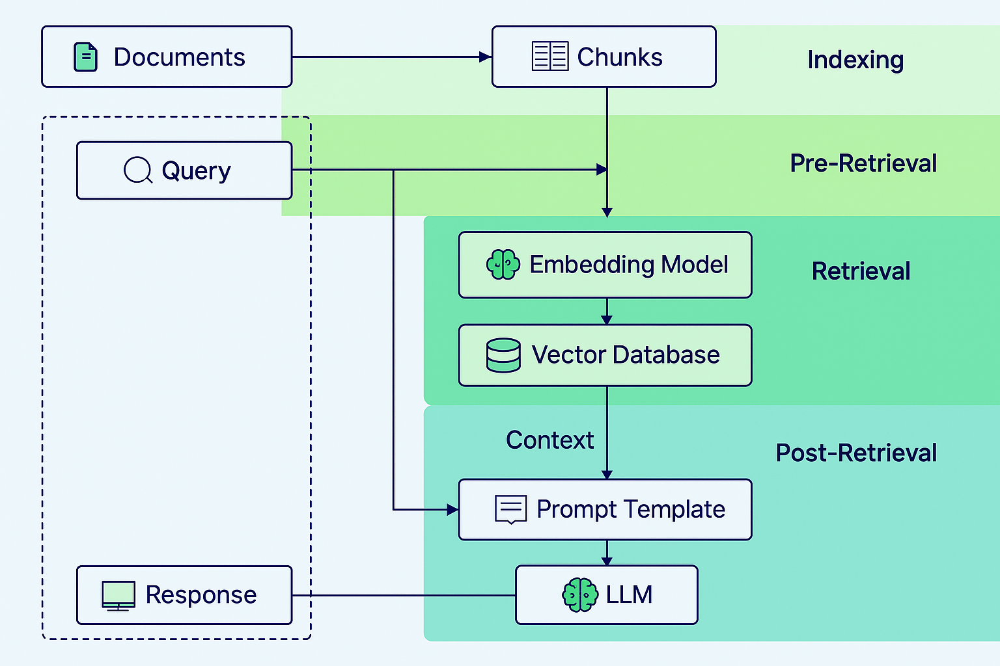

# Basic RAG

> **Retrieval‑Augmented Generation demo with LangChain, FAISS and OpenAI**



## Features
- Downloads Wikipedia articles on a topic of your choice via `WikipediaLoader`.
- Splits text into semantically coherent chunks with `SemanticChunker`.
- Creates an in‑memory FAISS vector store with OpenAI embeddings.
- Retrieves the most relevant chunks for a user question.
- Generates an answer with GPT‑3.5/4 using a prompt pulled from LangChain Hub.
- Everything runs in a single script: `naive_rag_wikipedia.py`.

## Quick start

```bash
# 1. Clone the repo
git clone https://github.com/felipeortizh/basic-RAG.git
cd basic-RAG

# 2. (Optional) create & activate a virtual environment
python -m venv .venv && source .venv/bin/activate      # macOS / Linux
# or on Windows
python -m venv .venv && .\.venv\Scripts\activate

# 3. Install dependencies
pip install -r requirements.txt
```

### Environment variables
Set your OpenAI API key before running:

```bash
export OPENAI_API_KEY="sk-..."            # macOS / Linux
setx OPENAI_API_KEY "sk-..."              # Windows
```

### Run the demo
```bash
python naive_rag_wikipedia.py
```

Sample output:

```
Starting document loading...
Documents loaded successfully: 2 documents
Creating text splits...
Created 34 text splits
Creating vector store...
Vector store created successfully
...
Result: The main areas of Artificial Intelligence are...
```

## How it works

1. **Ingest** – `WikipediaLoader` fetches up to *n* articles for the query defined in the script (default: *"Artificial Intelligence"*).
2. **Chunk** – `SemanticChunker` breaks each article into ~500‑token, semantically coherent chunks.
3. **Index** – Each chunk is embedded with `OpenAIEmbeddings` and stored in a FAISS index.
4. **Retrieve** – The top‑k chunks relevant to the user question are retrieved.
5. **Generate** – Chunks are injected into a RAG prompt template from LangChain Hub and sent to the LLM for the final answer.

```
Wikipedia → Chunk → FAISS → Retriever → Prompt → LLM
```

## Customisation

| Change you want                        | Where to edit                          |
|----------------------------------------|----------------------------------------|
| Topic to search on Wikipedia           | `query` argument of `WikipediaLoader`  |
| Number of articles to load             | `load_max_docs`                        |
| Embedding model                        | `OpenAIEmbeddings()`                   |
| Vector store implementation            | replace `FAISS` with any LangChain store |
| LLM model                              | `ChatOpenAI(model_name="gpt-3.5-turbo")` |

## Repository structure
```
basic-RAG/
├── naive_rag_wikipedia.py   # end‑to‑end RAG pipeline
├── requirements.txt         # Python dependencies
└── README.md                # You are here
```

## Roadmap
- [ ] Parse CLI arguments for topic, doc count & model selection
- [ ] Add persistence to the FAISS index
- [ ] Stream token-by-token LLM output
- [ ] Unit tests

## Contributing
Contributions are welcome! Please open an issue to discuss your ideas or submit a pull request.

## License
Released under the MIT License.
